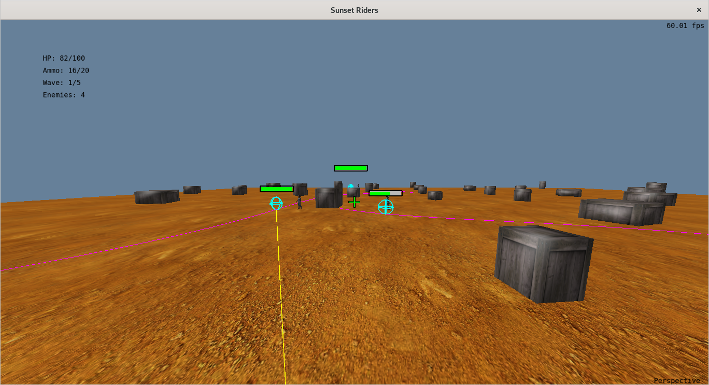
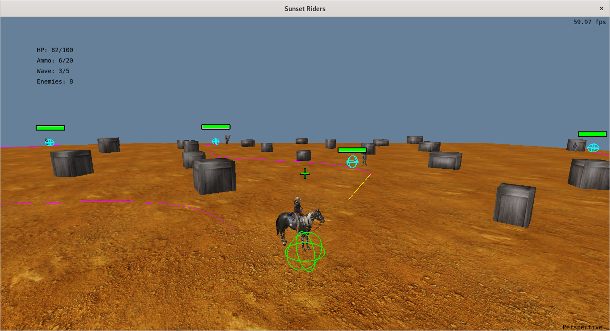

# Trabalho final de INF01047 - Fundamentos de Computação Gráfica

Projeto elaborado pelos alunos Lucas Wermann e Pedro Bavaresco

---
## O jogo

Uma versão 3D inspirada no clássico Sunset Riders, onde o jogador assume o papel de um cowboy que percorre um cenário de velho oeste repleto de obstáculos e inimigos. A cada wave, novos bandidos surgem atirando e tornando o ambiente cada vez mais desafiador, com a dificuldade aumentando progressivamente conforme o jogador avança. O objetivo é simples e direto: sobreviver ao ataque das ondas de inimigos e eliminar todos eles antes que acertem o jogador um número de vezes e coloquem fim à missão.

---
## Contribuições de cada membro da dupla

**Pedro**
- Carregamento de arquivos .obj
- Instanciação e desenho dos objetos
- Mapeamento de texturas
- Câmeras (primeira e terceira pessoa)
- Movimentação do jogador
- Modelos de iluminação (difusa, Blinn-Phong e Gouraud)

**Lucas**
- Lógica geral do jogo (waves, sistema de tiro, etc.)
- Testes de colisões
- Curvas de Bézier para movimentação dos inimigos
- Raycasting
- Desenho das hitboxes, barras de vida e HUD

---
## Uso de IA

O ChatGPT foi utilizado como como ferramenta auxiliar ao longo do desenvolvimento e ajudou principalmente na navegação e compreensão da estrutura do código — especialmente por se tratar de um arquivo extremamente extenso — identificando trechos relevantes, explicando dependências internas e localizando possíveis pontos de falha. Também contribuiu para esclarecer conceitos de shaders, iluminação e matrizes de transformação. No entanto, houve situações em que a ferramenta não conseguiu resolver problemas do projeto, como em questões mais sensíveis de mapeamento de texturas, detalhes finos do comportamento da câmera e bugs que dependiam de entender a execução completa do jogo, o que muitas vezes levava a sugestões imprecisas ou incompatíveis.

---
## Desenvolvimento e requisitos

**Objetos virtuais representados através de malhas poligonais complexas**
- *cowboy.obj* (modelo do jogador, mais complexo que o cow.obj fornecido)
- *bandit.obj* (modelo de inimigos)  
✅ Requisito cumprido.

**Transformações geométricas**
- Translação, rotação e escala aplicadas no desenho do jogador e inimigos
- Rotação contínua dos inimigos para olhar em direção ao jogador
- Transformações acumuladas via MatrixTranslate, MatrixRotateY, MatrixScale
- Uso correto de matrizes model, view e projection, enviadas ao shader  
✅ Requisito cumprido.

**Controle de câmeras virtuais**
- Câmera em terceira pessoa, posicionada atrás do jogador, acompanhando seus movimentos e sempre orientada para ele
- Câmera em primeira pessoa, colocada na altura dos olhos do personagem e alinhada com sua direção de visão, permitindo ao jogador enxergar diretamente pelo ponto de vista do cowboy  
✅ Requisito cumprido.

**Objeto copiado com duas ou mais instâncias**
- Todos os inimigos usam a mesma malha (bandit.obj)
- O modelo de caixa (the_cube) é desenhado em diversas posições do cenário  
✅ Requisito cumprido.

**Interseccão entre objetos virtuais**
- Raycast da câmera, verificando colisão com caixas (AABB), jogador e inimigos
- Raycast dos inimigos, determinando se o jogador está na linha de tiro e aplicando dano quando não há obstáculos bloqueando
- Interseção de raio com AABB para caixas, usando o método Slab
- Interseção de raio com esferas para entidades (jogador e inimigos), baseada em distância ponto–raio
- Hitboxes desenhadas como esferas wireframe, facilitando a inspeção visual da área real de colisão utilizada nas verificações
Embora o sistema de interseção esteja funcional, não conseguimos implementar as colisões em um módulo separado (collisions.cpp) devido à complexidade crescente do projeto e ao tempo limitado.  
⚠️ Requisito parcialmente cumprido.

**Modelos de iluminação**
- No fragment shader, tanto o jogador quanto os inimigos utilizam uma combinação de Lambert + Blinn-Phong, enquanto o chão utiliza exclusivamente iluminação difusa. O shader possui suporte completo a Gouraud shading, mas nenhum objeto do jogo utiliza efetivamente o modo Gouraud durante a execução.  
⚠️ Requisito parcialmente cumprido.

**Mapeamento de texturas**
- Jogador (cowboy.obj): o mapeamento UV fornecido pelo arquivo OBJ funciona corretamente.
- Inimigos (bandit.obj): embora o shader suporte texturas, parte das UVs do modelo importado apresenta inconsistências.
- Chão (plane.obj): o plano utiliza mapeamento UV contínuo com repetição de textura (sand.jpg). Isso evita esticamento e cria um piso natural repetido.
- Obstáculos (cube.obj): utilizam textura crate.jpg  
⚠️ Requisito parcialmente cumprido.

**Curvas de Bézier**
- O código implemente cálculo de curvas Bezier cúbicas (usadas para visualizar o trajeto dos inimigos), interpolação ponto a ponto, e desenho com GL_LINE_STRIP.  
✅ Requisito cumprido.

**Animação baseada no tempo**
- Movimentação contínua do jogador baseada em delta_time
- Movimentação dos inimigos e atualização de suas direções
- Raycasts temporários com timeout
- Sistema de waves com timers: g_WaveClearedTimer, glfwGetTime()
- Atualização da câmera com variação suave conforme o tempo  
✅ Requisito cumprido.

---
## Imagens

---
## Manual de utilização

###  Como jogar

Esconda-se atrás dos obstáculos para se defender dos inimigos, atire na hitbox deles para danificá-los, até que desapareçam. Esteja sempre atento à sua munição e recarregue-a quando necessário. Quando todos os inimigos da wave forem eliminados, você avança para a próxima e seu HP é restaurado. Se o HP zerar, você perde o jogo. Se sobreviver até a última wave e concluí-la, você vence.

### Controles

- **W A S D** para movimentar o jogador
- **Shift** para correr
- **E** para forçar inimigos próximos a atirarem no jogador
- **R** para recarregar a munição
- **Tab** para alternar modo da câmera
- **Mouse** para rotacionar a câmera
- **Scroll** para ajustar zoom da câmera
- **Botão esquerdo** para atirar
- **Esc** para encerrar o jogo

